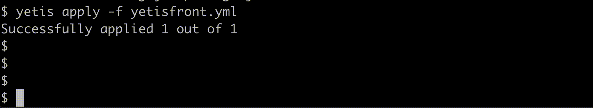

# Yetis (WIP)
Kubernetes for linux processes.  

## Use Case
Containers need virtualization and your 5$ VPS doesn't support it? 
But you would still like some nice features of `k8s`? Read further.

## Features of Yetis
1. Kubernetes-like declarative configuration.
2. Self-healing. Automatically restarts failed processes. Kills and recreates unresponsive processes.
3. Log management. It saves the standard output into iterative log files.
4. (WIP) Zero downtime deployment. Achieved with a sidecar proxy.

## Installing
Download `yetis` binary file from `build` folder and scp it to your VPS.
WIP
Debian package
```shell
apt install yetis
```

## Commands
*You don't need to be `root`.
### Start Yetis server
```shell
yetis start
```
Add `&` at the end to start in the background.
WIP systemctl
### Available commands
#### Deploy your process:
```shell
yetis apply -f config.yaml
``` 
[Configuration](#file-configuration)  

#### List deployments
`yetis list` will show the list of the processes.    
Add flag `-w` to watch the updates


#### Full list of commands
```
	start            start Yetis server
	shutdown         terminate Yetis server
	apply -f [path]  create new deployments from the yaml configuration starting its processes.
	list             list the managed deployments
	describe [name]  get full info of the deployment 
	delete [name]    deletes the deployment terminating its process. 
	help             prints the list of the commands
```

## Deployment configuration
As of now, Yetis only accepts YAML. You can specify multiple specs inside one file by separating them with `---`
#### Minimal required configuration. 
```yaml
spec:
  name: my-front
  cmd: npm start
  livenessProbe:
    tcpSocket:
      port: 3000
```

### Full configuration
```yaml
spec:
  name: hello-world # Must be unique per spec
  cmd: java HelloWorld # If proxy is enabled, start it on a port from YETIS_PORT env var.
  workdir: /home/user/myproject # Directory where command is executed. Defaults to the path in 'apply -f'. 
  logdir: /home/user/myproject/logs # Directory where the logs are stored. Defaults to the path in 'apply -f'.
  livenessProbe: # Checks if the command is alive on the YETIS_PORT, and if not then restarts it
    tcpSocket:
      port: 8080 # Ignored if proxy is configured. 
    initialDelaySeconds: 5 # Defaults to 10
    periodSeconds: 5 # Defaults to 10
    failureThreshold: 3 # Defaults to 3
    successThreshold: 1 # Defaults to 1
  env:
    - name: SOME_SECRET
      value: "pancakes are cakes made in a pan"
    - name: SOME_PASSWORD
      value: mellon
    - name: MY_PORT
      value: $YETIS_PORT # pass the value of the environment variable to another one. 
  proxy: # WIP: read the Proxy section
    port: 4567 # The port for the sidecar proxy to run. Your 'cmd' must start on YETIS_PORT env var.
    strategy:
      type: RollingUpdate # RollingUpdate or Recreate. Defaults to RollingUpdate.
```

### Liveness Probe
Checks if the process is alive and ready. Yetis relies on this configuration to restart the process. Plus if proxy is configured, then forward traffic to the `cmd` process. 
For now, the probe only supports tcpSocket. If proxy is configured, then $YETIS_PORT by default. It also acts as Readiness and StartUp Probes. If you need them, PRs are welcome.

### Proxy (WIP)
Proxy represents a sidecar proxy pattern. It is an optional configuration which allows you to have a zero downtime deployment.
It is achieved through RollingUpdate strategy in the load balancer. It will spawn a new instance,
update the LB and direct traffic to the new port, and only then will terminate the old instance. 
The load balancer will accept two ports which will be switched during the deployment.
If you specify the `Recreate` strategy, yetis will wait for the termination of old instance before starting a new one. 
#### Application
Your application specified in the `cmd` must start on a port provided in the `YETIS_PORT` environment variable.


