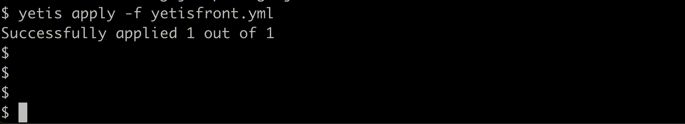

# Yetis

 System for managing applications on a single host.

---

### Use Case
You can't have Docker on your VPS but still want Kubernetes features.

## Features of Yetis
1. Simple declarative configuration.
2. Self-healing. Automatically restarts failed processes. Kills and recreates unresponsive processes.
3. Log management. It saves the standard output into iterative log files.
4. Zero downtime deployment, achieved with `RollingUpdate` strategy.

## Installing
```shell
sudo wget -O /usr/local/bin/yetis https://github.com/glossd/yetis/raw/refs/heads/master/build/yetis && chmod +x /usr/local/bin/yetis 
```
## Commands
### Start Yetis server
```shell
sudo yetis start
```
*Must be `root` to configure `proxy`  
Yetis will start in the background. You can pass [yetis server configuration](#yetis-server-configuration) with `-f` flag.

### Deploy your process:
```shell
yetis apply -f config.yaml
``` 
`apply` will restart the existing processes.

### Configuration examples
A simple process to watch over and restart, if port becomes unavailable:
```yaml
spec:
  name: frontend # NAME must be unique
  cmd: npm start
  workdir: /home/user/myfront
  livenessProbe:
    tcpSocket:
      port: 3000
```
Zero-downtime is achieved by specifying a `proxy.port` which creates an iptables port forwarding rule.  
In the example below, all the traffic from port `2345` will be forwarded to the `frontend` process, which will be running on a dynamic port `YETIS_PORT`
```yaml
spec:
  name: frontend
  cmd: npm start
  workdir: /home/user/myfront
  strategy:
    type: RollingUpdate # For zero downtime
  env:
    - name: APP_PORT # Copies the value from YETIS_PORT to APP_PORT
      value: $YETIS_PORT
  proxy:
    port: 2345 # Forwards traffic from 2345 to the port in YETIS_PORT env var. 
```

### List the managed processes
`yetis list` will show the list of the processes.    
Add flag `-w` to watch the updates


## Full list of commands
```
Server Commands:
	start [-f FILENAME]     start Yetis server
	shutdown                terminate Yetis server
	info                    print server status
Resources Commands:
	apply -f FILENAME       apply a process configuration from yaml file, creates new or restarts existing ones.
	list [-w]               print a list the deployments
	logs [-f] NAME          print the logs of the selected deployment 
	describe NAME           print a detailed description of the selected deployment
	delete NAME             delete and terminate the selected deployment
	restart NAME            restart the selected deployment according to its strategy type 
	help                    print the list of the commands
```

## Process configuration
```yaml
spec:
  name: hello-world # Must be unique
  preCmd: javac HelloWorld.java # Command to execute before starting the process.  
  cmd: java HelloWorld # Each process is executed within its own session.
  workdir: /home/user/myproject # Directory where command is executed. Defaults to the path in 'apply -f'. 
  logdir: /home/user/myproject/logs # Directory where the logs are stored. Defaults to the path in 'apply -f'.
  strategy:
    type: Recreate # Recreate or RollingUpdate. Defaults to Recreate.
  livenessProbe: # Checks if the command is alive and if not then restarts it
    tcpSocket:
      port: 8080 # Should be specified if proxy is not configured. Defaults to $YETIS_PORT 
    initialDelaySeconds: 5 # Defaults to 10
    periodSeconds: 5 # Defaults to 10
    failureThreshold: 3 # Defaults to 3
    successThreshold: 1 # Defaults to 1
  env: # YETIS_PORT env var is passed by default. You should use alongside proxy config. 
    - name: SOME_SECRET
      value: "pancakes are cakes made in a pan"
    - name: SOME_PASSWORD
      value: mellon
    - name: MY_PORT
      value: $YETIS_PORT # pass the value of the environment variable to another one.
  proxy:
    port: 8080 # Tells linux to forward from the specified port to $YETIS_PORT, allowing zero downtime restarts.
```

### Liveness Probe
Checks if the process is alive and ready.  Yetis relies on this configuration to restart the process.
Plus if `proxy.port` is configured, then to forward the traffic to the new deployment. 
For now, the probe only supports tcpSocket. Liveness also acts as Readiness and StartUp probes.

### Deployment Strategies
`RollingUpdate` strategy (zero downtime): Your deployment must start on `$YETIS_PORT` and have a `proxy.port` configured. `apply` or `restart` commands will spawn a new process and will check if it's healthy with [livenessProbe](#liveness-probe),
then direct traffic to the new instance, and only then will terminate the old instance. The new deployment will have the name with an index i.e. frontend-1, frontend-2 and so on.  
`Recreate` strategy: Yetis will wait for the termination of the old instance before starting a new one with the same name.
It's the same as in [Kubernetes](https://medium.com/@muppedaanvesh/rolling-update-recreate-deployment-strategies-in-kubernetes-️-327b59f27202)

## Yetis Server Configuration
Provide configuration when starting Yetis: `yetis start -f /path/to/config.yml`
#### Alerting
You can configure server to send you alerts of your deployment's failure or recovery from failure.
For now, yetis only supports mail alerting through SMTP.
#### Full Yetis Configuration 
```yaml
logdir: /tmp # yetis.log will be stored in there. Defaults to /tmp
alerting: # Alerts when a managed process fails or recovers.
  mail: # add SMPT creds of your smpt server for alerting
    host: smtp.host.com
    port: 587
    from: noreply@mail.com
    to:
      - yourmail@mail.com
    username: authUser
    password: authPass
```
